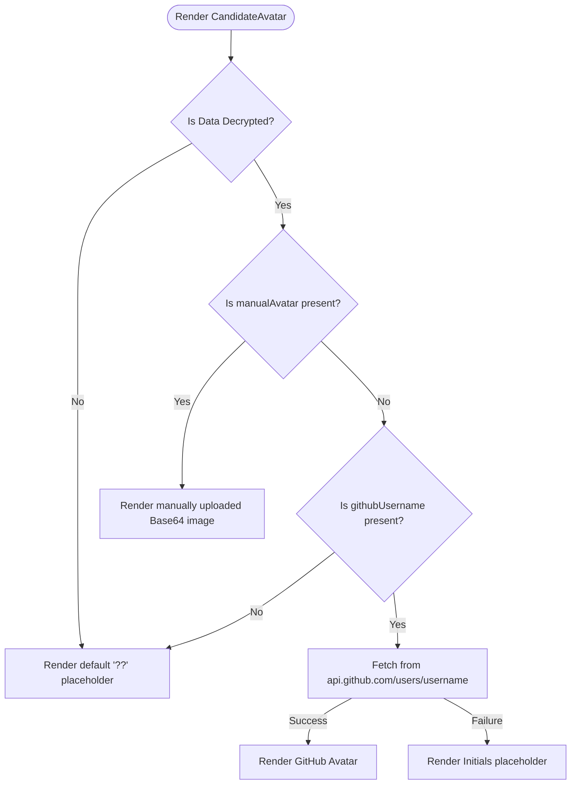

# GitHub Integration & Candidate Profile Switcher

This document details the architecture, fallback hierarchy, and cryptographic transmission flow for candidate profile pictures and GitHub information within the Leddger-AI platform.

---

## 📸 1. Smart Profile Image Switcher

The recruiter panel includes a smart `CandidateAvatar` component designed to display the candidate's profile picture with a premium circular pill layout. It uses a tiered fallback system to display the most relevant image.

### Fallback Hierarchy
1. **Manually Uploaded Avatar (`manualAvatar`):** If the candidate uploads a custom profile picture in the student portal, it takes immediate priority. It is read as a Base64 DataURL and rendered on the dashboard.
2. **GitHub Avatar (`githubUsername`):** If no manual avatar is uploaded but a GitHub username is supplied, the application triggers a fetch request to `https://api.github.com/users/{username}` on mount. It extracts the `avatar_url` value and renders the image.
3. **Initials / Placeholder Avatar:** If the GitHub API request fails (e.g., 404 Not Found), or if no GitHub username was provided, the component falls back to rendering:
   - The first two letters of the GitHub username (capitalized) in a styled pure-white text bubble.
   - An empty placeholder state (`??`) if no username exists.

---

## 🔒 2. Cryptographic Security Flow

To preserve candidate privacy, all profile data (including the Base64 image payload) is encrypted on the client side before submission.

1. **Local Encryption (Student Portal):**
   - The student inputs their Project Idea, Working Procedure, Experience, GitHub Username, and uploads an optional Profile Picture.
   - The profile picture is read locally using `FileReader.readAsDataURL()`.
   - The form values are bundled into a JSON payload.
   - The payload is encrypted locally using **AES-256 (CryptoJS)** with a key derived from the recruiter's unique code (`secret-key-REC-XXXXXX`).
   - Only the encrypted ciphertext is submitted.

2. **Local Decryption (Recruiter Dashboard):**
   - The recruiter enters the derived local decryption key.
   - The ciphertext payload is decrypted entirely in the browser memory.
   - The decrypted GitHub Username and manual profile picture are resolved and supplied to the `CandidateAvatar` component.

---

## 📊 3. GitHub Project Analysis & Engagement Tracker (Phase 2)

When candidate credentials are successfully decrypted in the recruiter panel, a dedicated repository intelligence dashboard section is rendered via the `<GithubAnalysis />` component.

### 1. Visual Grid Architecture
The dashboard displays three core sections in a responsive CSS Grid layout:
- **Commit Pulse Graph (90 Days):** A contribution heatmap showcasing the developer's commit density over time (14 columns x 7 rows representing a 98-day timeline). The contribution squares render in varying opacities of cyan (`#00f0ff`) depending on activity levels.
- **Tech Stack Distribution:** A horizontal progress bar summarizing the languages used across the developer's repositories. Each language segment is dynamically colored with a high-contrast palette (TypeScript, Python, JavaScript, CSS, Shell, and Docker). Legend labels and percentage numbers are strictly rendered in pure white (`#FFFFFF`) next to their colored indicator dots.
- **AI Attribution Summary:** Displays vertical progress bars for **Code Readability** and **Modular Structure** alongside a contextualized textual assessment highlighting project structure, modularity, and security feedback.

### 2. Public API Telemetry & Fallbacks
- **GitHub API Ingestion:** On mount, if a valid GitHub username is decrypted, a request is made to `https://api.github.com/users/{username}/repos?per_page=100&sort=updated`.
- **Dynamic Stack Analysis:** Calculates real programming language weights by parsing the `.language` property across all public candidate repositories.
- **Smart Context Fallback:** If the API request is rate-limited, fails, or if no username is supplied:
  - Generates a deterministic commit pulse grid based on the hash of the username.
  - Matches the tech stack composition to keywords inside the decrypted project idea (e.g. automatically shifting to Python/Docker for AI/Algorithm-focused projects).
  - Populates a highly tailored AI Analysis report reflecting years of experience.

---

## 🔓 4. Candidate GitHub App Authorization Flow (Phase 1)

Ledger AI utilizes a secure OAuth flow with the GitHub App to let candidates grant the platform access to profile details and code metadata.

### 1. Connection Redirection (Student Portal)
- Clicking **"Connect GitHub"** in the candidate application form redirects the user to:
  `https://github.com/login/oauth/authorize?client_id={CLIENT_ID}&redirect_uri={REDIRECT_URI}&state={STATE}&scope=user:email`
- This prompts the user to grant read-only access to their profile and email address.

### 2. Token Exchange & Metadata Extraction (FastAPI Callback)
- GitHub redirects the candidate back to our backend callback endpoint: `/api/github/callback?code={code}&state={state}`.
- The backend exchanges the code server-to-server for a **User Access Token** by querying `https://github.com/login/oauth/access_token` using standard non-dependency `urllib.request`.
- With the retrieved token, the backend requests the authenticated candidate's details (`https://api.github.com/user`) to fetch their verified username (`login`).
- The backend then triggers a client-side redirect back to the React app:
  `http://localhost:5173/candidate-flow?githubUsername={username}&githubToken={token}&status=connected`

### 3. Portal Auto-Population
- On page load, `StudentPortal.jsx` checks for redirect callback URL parameters. If connection details are found, the portal:
  - Stores the access token in local storage for upcoming repository selections.
  - Auto-populates the candidate's verified GitHub Username input field.

